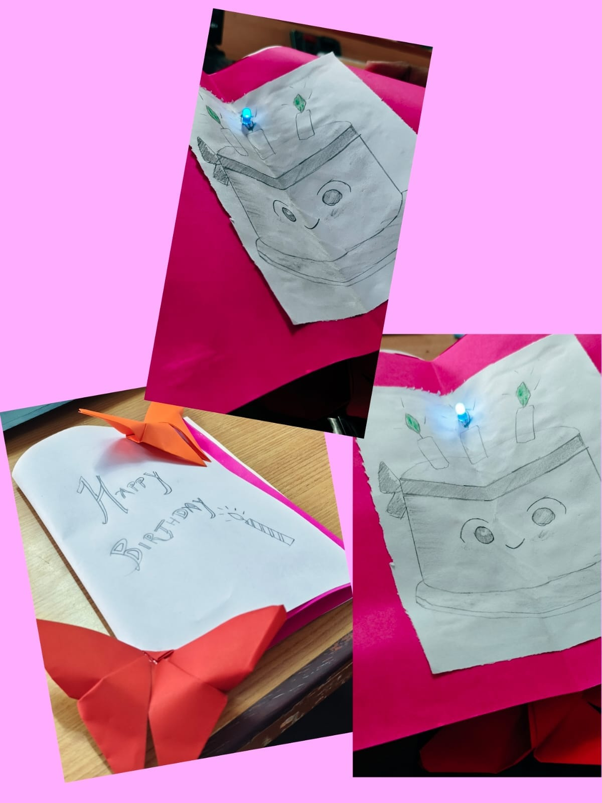

#                  Chip squad

           **LED-Based Greeting Card Using 3 V Battery**

Project Type: Simple electronic craft / mini embedded project Purpose: To design a greeting card with an integrated LED lighting feature using a small 3 V battery, colour paper, and aluminium material.

**1\. Aim**

To design and construct a decorative greeting card that produces light using an LED powered by a small 3 V battery, while using colour paper for the card body and aluminium material as a decorative and/or conductive element.

**2\. Required Materials**

|   s.no |          Required Material |  Purpose |
| :---- | :---- | :---- |
| **1\.** | colour paper | Card body and decoration |
| **2\.** | LED | Produces light 1  |
| **3\.** | 3v battery | Power Supply |
| **4\.** | Aluminium foil | Decoration |

**3\. Project Description**

The project is a paper-based greeting card with a simple electrical lighting circuit. A 3 V battery supplies electrical energy to one or more LEDs. The LED can be positioned behind a cut-out, transparent paper section, or decorative pattern so that the card illuminates when the circuit is switched on. Colour paper forms the main structure, while aluminium foil or sheet can be incorporated as a decorative layer or as part of a simple conductive contact/switch arrangement.

**4\. Basic Circuit**

| 3v Battery(+) | LED | switch | Battery(-) |
| :---- | :---- | :---- | :---- |
| Power Source | Light Output | ON/OFF control | Return Path |

Note: If an LED a battery arrangement that can supply more c the LED's sa suitable current-limiting resistor. With a single 3 V coi an appropriate t requi battery type. Verify the LED specification

**5\. Working Principle**

The battery provides approximately 3 V DC to the circuit. When the switch luctive closed, current flows through the LED and the LED emits light. Opening the contact breaks the circuit and turns the LED off. The electrical components can be hidden between layers yers of of paper to maintain the appearance of a normal greeting card.

**6\. Construction Procedure**

1\. Fold the colour paper to form the greeting-card body.

2\. Mark and cut a suitable window or decorative pattern where the LED light will be visible.

3\. Place the LED behind the opening and secure it with tape or adhesive.

4\. Connect the LED, battery and switch/contact using insulated wire.

5\. If aluminium foil is used as a contact, keep it isolated from unintended conductive paths.

6\. Fix the battery securely in an accessible location so it can be replaced when necessary.

7\. Cover the wiring with an additional paper layer for neatness and protection.

8\. Test the circuit before permanently sealing the card.

9\. Add the final greeting, colour decorations and aluminium design elements.

**8\. Applications**

Supplies low-voltage DC electrical energy.

Converts electrical energy into visible light.

Can be used for decoration and, when appropriately arranged, as a conductive contact.

Provides the card structure, appearance and electrical insulation.

Provides a controlled electrical path between components.

Controls the ON/OFF state of the LED.

• Birthday and celebration cards

• Festival and greeting cards

• School/college mini-projects

• Electronic craft demonstrations

• Introduction to simple electrical circuits

**9\. Advantages**

• Low-voltage and simple circuit

• Lightweight and portable

• Low material cost

• Easy to customize using paper and decorative materials

• Demonstrates a practical application of an LED circuit

**10\. Safety and Precautions**

• Check LED polarity before connecting the battery.

• Do not short-circuit the battery.

• Keep aluminium foil away from unintended electrical contacts.

• Insulate exposed wire connections.

• Do not use a damaged or leaking battery.

• Confirm the LED's electrical rating before connecting it directly to the selected battery.

**11\. Expected Result**

A functional decorative greeting card is produced in which the LED illuminates when the electrical contact/switch is closed. The circuit remains concealed within the card, while the colour paper and aluminium material provide the

required decorative finish.

**12\. Conclusion**

The LED greeting card demonstrates how a simple 3 V DC power source can be combined with an LED and basic conductive connections to create a useful and attractive electronic product. The project integrates basic electrical engineering with paper-based product design.

       
